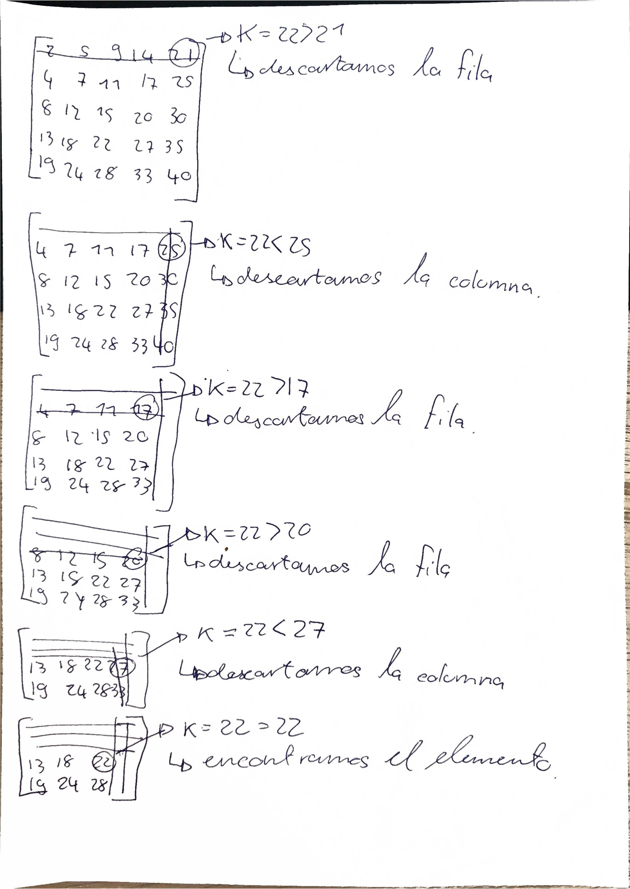

# Búsqueda de la matriz ordenada 

Objetivo: Determinar si un valor $K$ existe en la matriz minimizando el número de comparaciones. 

## Idea



## ¿Cómo? --> Descripción del algoritmo

- Empezar en la primera fila, última columna. Si en esa primera iteración se encuentra K, pues ahí se acaba.

- Si el valor actual es superior a K, sabemos automáticamente que todos los elementos en esa misma columna del valor actual hacia abajo también serán mayores que K. Entonces podemos descartar la columna entera y pasar una hacia la izquierda.

- Si el valor actual es inferior a K, sabemos automáticamente que todos los elementos a su izquierda en esa misma fila también serán inferiores a K. Entonces podemos descartar la fila entera y pasar una hacia abajo.

## Análisis de complejidad

- Mejor caso: 1 comparación O(1), el elemento que buscamos está en nuestra posición inicial.

- Peor caso: El peor caso ocurre cuando se nos obliga a recorrer la matriz entera, desde la esquina superior derecha hasta la esquina inferior izquierda. O(N+M-1) (-1 porque si no el elemento no existiría).

- En nuestra matriz, el peor caso sería encontrar el 19; habría un total de 9 comparaciones.

## Centro vs. Esquina

Iniciar la búsqueda desde el centro (dividiendo la matriz en cuadrantes) puede reducir comparaciones al buscar elementos centrales en matrices masivas. 

Sin embargo, el algoritmo desde la esquina mantiene una cota asintótica óptima y su implementación codificada es significativamente más simple y eficiente.

## ¿Existe un algoritmo mejor para el peor caso?

Como con la complejidad de esta propuesta, todas las demás también tienen que, como mínimo, recorrer toda la matriz para encontrar el peor caso.

## Código propuesto

[Codigo propuesto](src/BusquedaMatriz.java)

```java
public class BusquedaMatriz {

    public static boolean buscarMatriz(int[][] matriz, int k) {
        int filas = matriz.length;
        int columnas = matriz[0].length;
        
        int filaActual = 0;
        int columnaActual = columnas - 1;

        while (filaActual < filas && columnaActual >= 0) {
            int valorActual = matriz[filaActual][columnaActual];

            if (valorActual == k) {
                System.out.println(" El valor " + k + " encontrado en la posición (" + filaActual + ", " + columnaActual + ")!");
                return true;
            } else if (valorActual > k) {
                columnaActual--;
            } else {
                filaActual++;
            }
        }

        System.out.println("El valor " + k + " no existe en la matriz.");
        return false;
    }

    public static void main(String[] args) {
        int[][] miMatriz = {
            { 2,  5,  9, 14, 21},
            { 4,  7, 11, 17, 25},
            { 8, 12, 15, 20, 30},
            {13, 18, 22, 27, 35},
            {19, 24, 28, 33, 40}
        };

        buscarMatriz(miMatriz, 22);
        
        System.out.println("---");
        buscarMatriz(miMatriz, 16);
    }
}


